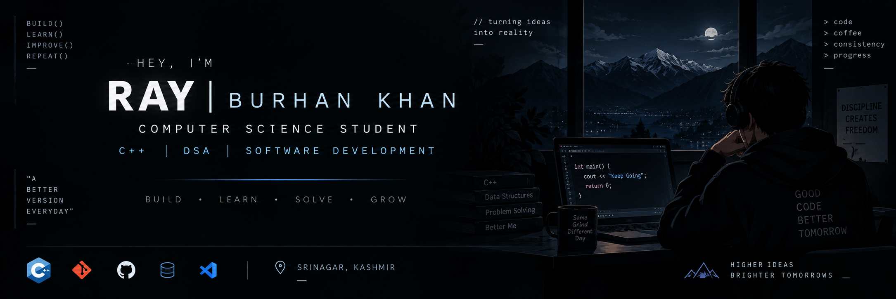

# Hey, I'm Ray 👋

### Computer Science Student | C++ & DSA | Learning by Building 🚀

I'm a B.Tech Computer Science student focused on building strong programming fundamentals and learning software development through hands-on projects.

## 👨‍💻 Currently Learning

- C++
- Object-Oriented Programming
- Data Structures & Algorithms
- Git & GitHub
- SQL

## 🚀 What I'm Working On

- 📚 Building a strong foundation in C++ and OOP
- 🧠 Practicing problem-solving and programming fundamentals
- 🌱 Exploring real-world problems through software projects
- 🔧 Learning to build, document, and improve projects

## 🎯 My Goal

To continuously learn, build meaningful projects, and grow into a strong software developer.

---

### 📌 Currently: Learning • Building • Improving

<!--
**burhankhanx777-dev/burhankhanx777-dev** is a ✨ _special_ ✨ repository because its `README.md` (this file) appears on your GitHub profile.

Here are some ideas to get you started:

- 🔭 I’m currently working on ...
- 🌱 I’m currently learning ...
- 👯 I’m looking to collaborate on ...
- 🤔 I’m looking for help with ...
- 💬 Ask me about ...
- 📫 How to reach me: ...
- 😄 Pronouns: ...
- ⚡ Fun fact: ...
-->
